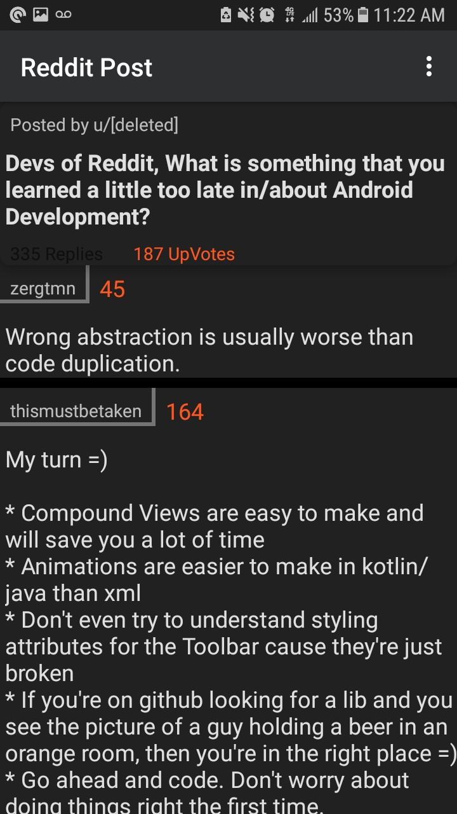
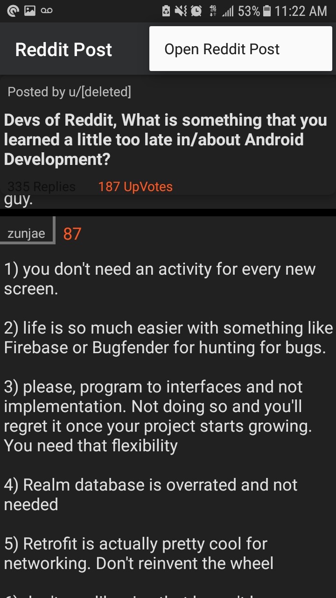

# Reddit Post
Fetches data from a helpful post on the android dev subreddit and displays the data in a recycler view accordingly.

  
   
   
   
  

## Installing
To install go to android studio -> file-> new-> project from version control-> Git-> paste in this url: https://github.com/That1guy17/RedditPost

You can then install from android studio.

## Primarily Built With
* RxJava 
* Retrofit
* Lifecycle Libraries
